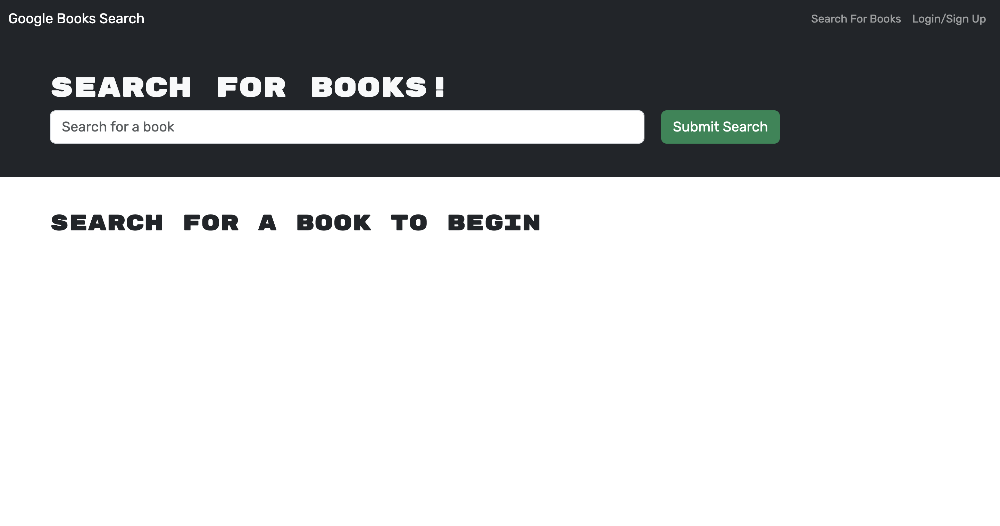

# 21 MERN: Book Search Engine

## License
&nbsp;

* Select the badge to see details.
* To see more about license badges, visit [Shields IO](https://shields.io/category/license)

&nbsp;

## Description
Data and user demands: these two factors drive almost all modern websites! User demands are constantly changing and users are wanting the ability to personalize their data. This is one of the cornerstones of real-world web development today.  To keep and grow a userbase, web apps need to also be changing in perfermoance and time usage efficiency.

This app targets readers and their abilty to access books in which they are interested, review them and save them to a list of books they would like to purchase.

&nbsp;

## Table of Contents

 * [Installation](#installation)
 * [Usage](#usage)
 * [Media](#media)
 * [Testing](#testing)
 * [Contribution](#contribution)
 

&nbsp;

## Installation

To be added

&nbsp;

[Table of Contents](#table-of-contents)

## Usage

To be added

&nbsp;

[Table of Contents](#table-of-contents)

## Media
_A brief overview of the project build_
&nbsp;

* Visit [Full Media]() (Heroku link to be added)

&nbsp;

[Table of Contents](#table-of-contents)

## Testing

Sandbox

&nbsp;

[Table of Contents](#table-of-contents)

## Questions

_If you have any questions, please feel free to contact me._

GitHub Username: [waynefenwick](https://github.com/waynefenwick)

Email Address: <a href="mailto:waynefenwick@gmail.com">waynefenwick@gmail.com</a>

&nbsp;

_Thanks for taking time to visit this repository!_

[Back to Top](#)

